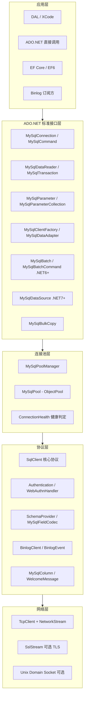
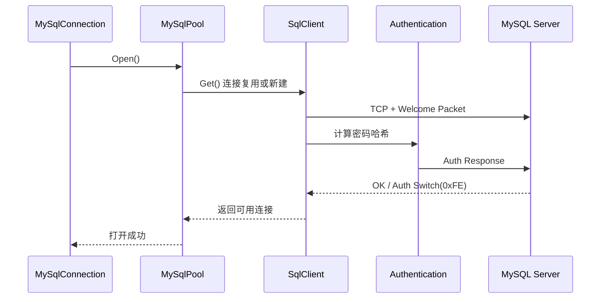
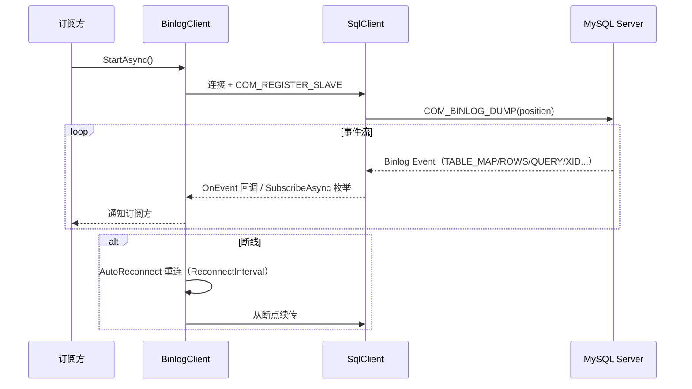
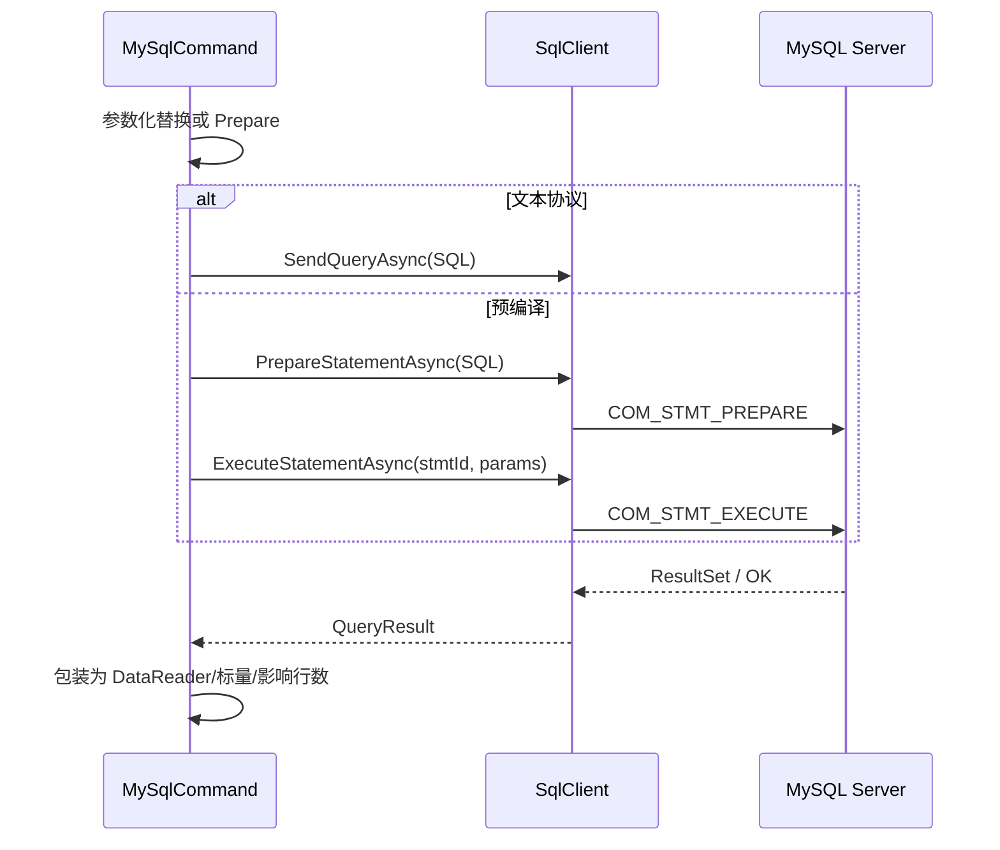
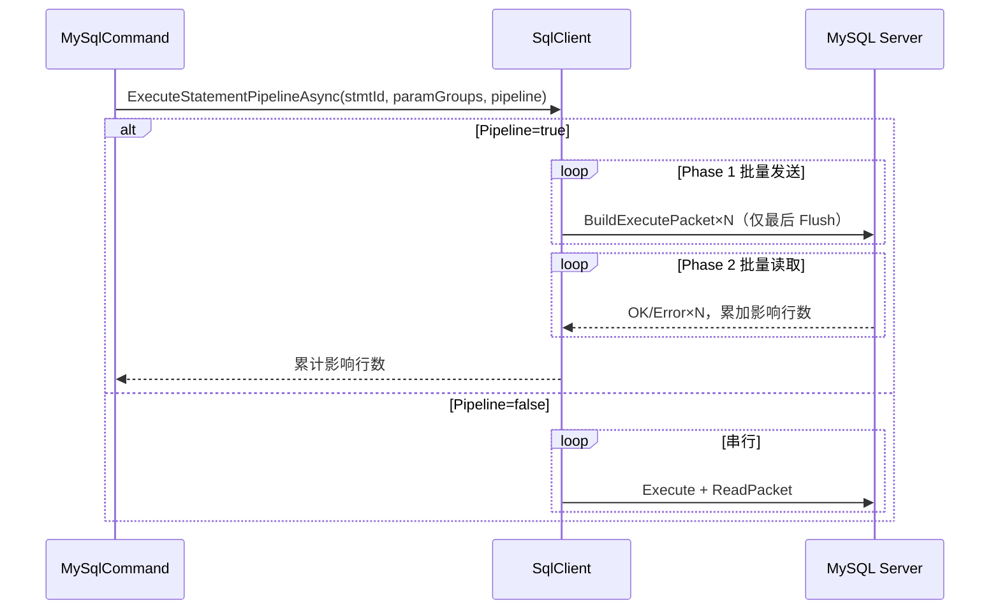

# NewLife.MySql 架构设计

> 版本：v1.3 | 日期：2026-08-02
> 需求对应：[需求文档](需求文档.md) | 功能清单：[功能清单](功能清单.md)

## 1. 整体架构

NewLife.MySql 采用**四层架构**，自上而下分为应用层、ADO.NET 标准接口层、连接池层、协议+网络层。核心协议实现集中在 `SqlClient` 单一类中，整体代码约 1.5 万行（含协议/认证/Binlog/批量），保持极简设计。



### 模块划分

| 模块 | 编码 | 覆盖组件 | 依赖 |
|------|------|----------|------|
| 系统基础 | SYS | 连接/认证/配置/连接池/健康检查/DataSource | 无（最底层） |
| 网络协议 | NET | 协议核心/压缩/Binlog/读缓冲 | SYS |
| 查询执行 | SQL | 查询/参数化/预编译/类型/事务/存储过程/DataReader/DataAdapter | SYS、NET |
| 批量操作 | BATCH | 批量 DML/管道化/BulkCopy/DbBatch | SQL |
| 元数据与兼容 | META | Schema 查询/兼容数据库 | SQL |
| 框架集成 | EF | XCode/EF Core/EF6 | SQL、SYS |

## 2. SYS 系统基础

### 2.1 职责

建立与管理数据库连接的底座：握手认证、连接配置、连接池与生命周期健康。

| 职责 | 说明 |
|------|------|
| 连接生命周期 | Open/Close/ChangeDatabase/GetSchema/BeginTransaction |
| 认证 | native_password / caching_sha2 / Auth Switch / WebAuthn / RSA |
| 连接配置 | 连接字符串 20+ 参数与别名解析 |
| 连接池 | 按连接字符串分池，池参数可配置 |
| 健康检查 | 活性/到龄/空闲验活纯逻辑判定 |

### 2.2 核心组件

| 组件 | 所在工程 | 说明 |
|------|----------|------|
| `MySqlConnection` | NewLife.MySql | DbConnection 实现，生命周期与状态管理 |
| `MySqlConnectionStringBuilder` | NewLife.MySql | 连接字符串解析，20+ 参数及别名 |
| `Authentication` | NewLife.MySql | 认证流程（SHA1/SHA256/RSA） |
| `WebAuthnHandler` | NewLife.MySql | WebAuthn/FIDO2 CBOR 编解码与断言构造 |
| `MySqlPoolManager` | NewLife.MySql | 连接池管理器（单例），克隆 Setting 快照防污染 |
| `MySqlPool` | NewLife.MySql | 继承 `ObjectPool<SqlClient>`，按连接字符串分池 |
| `ConnectionHealth` | NewLife.MySql | 连接复用判定纯函数（Reusable/NeedPing/Discard） |
| `MySqlDataSource` | NewLife.MySql | .NET 7+ DbDataSource，DI 集成 |
| `MySqlException` | NewLife.MySql | 驱动异常类型 |
| `ConnectAttributes` | NewLife.MySql | 连接属性（connect attrs）构造 |

### 2.3 关键流程

#### 连接建立与认证



#### 连接池借出校验（OnGet）

1. **纯逻辑判定**：`ConnectionHealth.Evaluate` 检查活性、存活期（`ConnectionLifeTime`）、空闲时长 → Reusable / NeedPing / Discard
2. **廉价 socket 探活**：`Socket.Poll` 非阻塞探测半开/对端关闭/残留数据
3. **异步 PING 验活**：仅当空闲超过 `ConnectionIdlePingTime` 时追加一次 PING，兜底黑洞型断连
4. 校验失败连接走 discard-retry 生命周期，`BusyCount` 记账无泄漏

## 3. NET 网络协议

### 3.1 职责

MySQL 二进制协议核心与高级传输能力：帧编解码、压缩、Binlog 订阅、零分配读取。

| 职责 | 说明 |
|------|------|
| 协议核心 | 帧封装/解析、COM_QUERY/STMT/INIT_DB、多结果集 |
| 压缩传输 | zlib 压缩（UseCompression），收发池化 |
| Binlog 订阅 | 事件流订阅、过滤、自动重连、断点续传 |
| 零分配 | ReadBuffer 复用、OwnerPacket/ArrayPool 管理 |

### 3.2 核心组件

| 组件 | 所在工程 | 说明 |
|------|----------|------|
| `SqlClient` | NewLife.MySql | 协议核心：握手/查询/预编译/管道化/压缩/断线重试 |
| `ReadBuffer` | NewLife.MySql | 读缓冲复用，减少分配 |
| `BinlogClient` | NewLife.MySql | Binlog 订阅高级封装（OnEvent/SubscribeAsync/StartAsync） |
| `BinlogEvent` / `BinlogEventType` / `BinlogPosition` | NewLife.MySql | Binlog 事件模型与位置 |
| `WelcomeMessage` / `ServerPacket` | NewLife.MySql | 握手与服务器包解析 |
| `ClientFlags` / `ServerStatusFlags` / `DBCmd` | NewLife.MySql | 协议标志与命令码 |
| `BinaryHelper` | NewLife.MySql | 协议二进制读写扩展 |
| `QueryResult` / `PrepareResult` | NewLife.MySql | 查询与预编译结果封装 |

### 3.3 关键流程

#### Binlog 订阅



#### 压缩协议（zlib）

- 认证后若双方支持 `COMPRESS` 且连接字符串 `UseCompression=true` 则开启
- 发送：`SendCompressedPacketAsync` 池化复用缓冲，延迟 Flush 合并小包
- 接收：`ReadCompressedPacketAsync` 处理 7 字节压缩帧头、跨包拼接、链式合并
- 协议细节：zlib 格式 + 普通帧头 + 未压缩包直通

## 4. SQL 查询执行

### 4.1 职责

ADO.NET 标准查询能力：执行接口、参数化、预编译、类型映射、事务、存储过程与结果集消费。

| 职责 | 说明 |
|------|------|
| 执行接口 | ExecuteReader/Scalar/NonQuery + 全链路 Async |
| 参数安全 | 客户端替换自动转义，防 SQL 注入 |
| 性能执行 | 预编译二进制协议（可选全局开启） |
| 类型系统 | 文本/二进制协议完整编解码 |
| 一致性 | 事务四种隔离级别、存储过程 IN/OUT |

### 4.2 核心组件

| 组件 | 所在工程 | 说明 |
|------|----------|------|
| `MySqlCommand` | NewLife.MySql | DbCommand 实现，含批量扩展与断线重试 |
| `MySqlParameter` / `MySqlParameterCollection` | NewLife.MySql | 参数模型与集合 |
| `MySqlDataReader` | NewLife.MySql | DbDataReader，多结果集/ReadModelsAsync/BulkRead |
| `MySqlTransaction` | NewLife.MySql | DbTransaction，自动回滚 |
| `MySqlDataAdapter` | NewLife.MySql | Fill DataTable/DataSet |
| `MySqlFieldCodec` | NewLife.MySql | 字段编解码（文本/二进制协议） |
| `MySqlColumn` | NewLife.MySql | 结果集列元数据 |
| `MySqlDbType` / `MySqlCharSet` | NewLife.MySql | 类型与字符集枚举 |
| `MySqlGeometry` | NewLife.MySql | WKB 空间类型封装 |

### 4.3 关键流程

#### 查询执行



#### 事务与存储过程

- **事务**：`SET TRANSACTION` 设置隔离级别 → `BEGIN` → 业务 SQL → `COMMIT/ROLLBACK`；Dispose 未提交自动回滚
- **存储过程**：`SET @p=val; CALL proc(@p1,@p2); SELECT @p2` 多语句一次网络往返，OUT 参数事后读取

## 5. BATCH 批量操作

### 5.1 职责

大数据批量 DML 与导入：多通道批量执行、管道化批发批收、BulkCopy 应用层导入。

| 职责 | 说明 |
|------|------|
| 字典批量 | ExecuteBatch：同一 SQL 多组字典参数 |
| 数组绑定 | ExecuteArrayBatch：Oracle 风格 |
| 管道化 | 批发批收，网络延迟仅一次 |
| 批量导入 | BulkCopy：DataTable/IDataReader → 表 |

### 5.2 核心组件

| 组件 | 所在工程 | 说明 |
|------|----------|------|
| `MySqlCommand.ExecuteBatch/ExecuteArrayBatch` | NewLife.MySql | 批量 DML 入口 |
| `SqlClient.ExecuteStatementPipelineAsync` | NewLife.MySql | 管道化/串行批量执行 |
| `SqlClient.BuildExecutePacket` | NewLife.MySql | EXECUTE 包构建（与发送解耦，缓冲复用） |
| `MySqlBulkCopy` | NewLife.MySql | 应用层批量导入（Pipeline+预编译+事务） |
| `MySqlBatch` / `MySqlBatchCommand` / `MySqlBatchCommandCollection` | NewLife.MySql | .NET 6+ DbBatch 标准 API |

### 5.3 关键流程

#### 管道化执行



- **错误处理**：某命令失败时继续读取后续响应保持连接干净，最后抛出第一个错误
- **批量导入（BulkCopy）**：`DataTable/IDataReader` → 分批（默认 1000 行）→ Prepare + Pipeline 执行 + 可选事务；`RowsCopied` 事件通知；不使用 LOAD DATA（安全风险）

## 6. META 元数据与兼容

### 6.1 职责

数据库元数据查询与多数据库兼容识别。

| 职责 | 说明 |
|------|------|
| Schema 查询 | 基础 + 扩展集合元数据 |
| 兼容识别 | 握手版本串自动检测数据库类型 |

### 6.2 核心组件

| 组件 | 所在工程 | 说明 |
|------|----------|------|
| `SchemaProvider` | NewLife.MySql | GetSchema 实现：Databases/Tables/Columns/Indexes/Procedures/Views/Triggers/ForeignKeys/Users/DataTypes/ReservedWords 等 |
| `DatabaseType` | NewLife.MySql | 数据库类型枚举与检测 |
| `MySqlConnection.GetSchema` | NewLife.MySql | ADO.NET 标准元数据入口 |

### 6.3 兼容数据库检测

握手版本字符串自动识别：MySQL（`8.0.26`）、OceanBase（含 `OceanBase`）、TiDB（含 `TiDB`）、Doris（含 `Doris`）、Aurora、CloudSQL、MariaDB。

## 7. EF 框架集成

### 7.1 职责

生态集成：XCode ORM 自动识别、EF Core / EF6 Provider 独立包。

| 职责 | 说明 |
|------|------|
| XCode 集成 | MySqlClientFactory 注册为 MySQL 驱动 |
| EF Core | 类型映射、LINQ 翻译、迁移 |
| EF6 | 全套 Provider 服务 |

### 7.2 核心组件

| 组件 | 所在工程 | 说明 |
|------|----------|------|
| `MySqlClientFactory` | NewLife.MySql | DbProviderFactory，XCode DAL 自动识别 |
| `MySqlDbContextOptionsExtensions` | NewLife.MySql.EntityFrameworkCore | `UseMySql` 扩展方法 |
| EF Core Provider 全套 | NewLife.MySql.EntityFrameworkCore | Storage/Query/Metadata/Migrations/Infrastructure |
| `MySqlEFConfiguration` 等 | NewLife.MySql.EntityFramework | EF6 Provider 服务 |
| `MySqlMigrationSqlGenerator` 等 | NewLife.MySql.EntityFramework | EF6 迁移生成 |

## 8. 数据模型

### 8.1 MySQL 协议包格式

```
+-------------------+-------+-----------+
|  payload_length   |  seq  |  payload  |
|     3 bytes       | 1byte | N bytes   |
+-------------------+-------+-----------+
```

- `payload_length`：3 字节小端序，最大 16MB（0xFFFFFF）
- `seq`：1 字节序列号，每次请求重置为 0，每个包递增
- 超过 16MB 的数据包自动拆分为多个 16MB 帧

### 8.2 数据类型映射

| MySQL 类型 | MySqlDbType | .NET 类型 |
|-----------|-------------|----------|
| TINYINT | `Byte` | `SByte` |
| SMALLINT | `Int16` | `Int16` |
| MEDIUMINT | `Int24` | `Int32` |
| INT | `Int32` | `Int32` |
| BIGINT | `Int64` | `Int64` |
| FLOAT | `Float` | `Single` |
| DOUBLE | `Double` | `Double` |
| DECIMAL / NUMERIC | `NewDecimal` | `Decimal` |
| VARCHAR / CHAR | `VarChar` / `String` | `String` |
| TEXT (各种) | `Text` 等 | `String` |
| BLOB (各种) | `Blob` 等 | `Byte[]` |
| DATETIME / TIMESTAMP | `DateTime` / `Timestamp` | `DateTime` |
| DATE / TIME | `Date` / `Time` | `DateTime` |
| BIT | `Bit` | `Boolean` |
| JSON | `Json` | `String` |
| ENUM | `Enum` | `String` |
| GEOMETRY | `Geometry` | `MySqlGeometry` |

#### 参数化查询类型映射

| .NET 类型 | SQL 字面量 |
|-----------|-----------|
| `String` | `'hello'`（自动转义） |
| 数字类型 | `42` |
| `Boolean` | `1` / `0` |
| `DateTime` / `DateTimeOffset` | `'2025-07-01 12:30:00'`（InvariantCulture） |
| `Byte[]` | `X'CAFE'` |
| `Guid` | `'01234567-89ab-cdef-...'` |
| `Enum` | 转为数字 |
| `Single` / `Double` | 往返格式（`R`） |
| `Decimal` | 原样输出 |
| `null` / `DBNull.Value` | `NULL` |

### 8.3 连接字符串模型

| 参数 | 别名 | 默认值 | 说明 |
|------|------|--------|------|
| Server | DataSource, Data Source | - | 服务器地址 |
| Port | - | 3306 | 端口号 |
| Database | - | - | 数据库名 |
| UserID | Uid, User Id, User | - | 用户名 |
| Password | Pass, Pwd | - | 密码 |
| ConnectionTimeout | Connection Timeout | 15 | 连接超时（秒） |
| CommandTimeout | Default Command Timeout | 30 | 命令超时（秒） |
| SslMode | Ssl Mode | None | SSL 模式 |
| Socket | unixsocket, pipe name | - | Unix 域套接字路径 |
| UseCompression | - | false | zlib 压缩协议开关 |
| UseServerPrepare | Use Server Prepare | false | 全局服务端预编译开关 |
| Pipeline | Pipelining | false | 管道化执行开关 |
| RetryOnNetworkFailure | - | true | 网络失败重试（仅读语句） |
| TracePackets | - | false | 包级跟踪 |
| MinPoolSize | Min Pool Size | 0 | 连接池最小连接数 |
| MaxPoolSize | Max Pool Size | 100 | 连接池最大连接数 |
| LoadBalanceTimeout | - | - | 负载均衡超时 |
| ConnectionLifeTime | Connection Lifetime | 600 | 连接最大存活期（秒），0 禁用 |
| IdlePoolTime | - | - | 空闲池回收时间 |

### 8.4 MySQL 版本兼容矩阵

| 特性 | MySQL 5.5 | MySQL 5.6 | MySQL 5.7 | MySQL 8.0 | MySQL 8.4 | MySQL 9.0 |
|------|-----------|-----------|-----------|-----------|-----------|-----------|
| 默认认证 | native_password | native_password | native_password | caching_sha2 | caching_sha2 | caching_sha2 |
| COM_RESET_CONNECTION | ✗ | ✗ | ✓ | ✓ | ✓ | ✓ |
| JSON 类型 | ✗ | ✗ | ✓ | ✓ | ✓ | ✓ |
| TLS 1.3 | ✗ | ✗ | ✗ | ✓ (8.0.16+) | ✓ | ✓ |
| mysql_native_password | 默认 | 默认 | 默认 | 可用 | 废弃 | 已移除 |

## 9. 技术选型

| 领域 | 选型 | 理由 |
|------|------|------|
| 基础框架 | NewLife.Core | 同为 NewLife 团队出品，提供 ObjectPool / ArrayPool / Pool.StringBuilder 等基础设施 |
| 网络通信 | TcpClient + NetworkStream | 标准 .NET TCP 通信，全框架兼容 |
| TLS 加密 | SslStream | 标准 .NET SSL/TLS 实现，条件编译适配 TLS 1.3 |
| 内存管理 | ArrayPool + OwnerPacket | 零额外分配，减少 GC 压力 |
| 连接池 | ObjectPool\<SqlClient\> | NewLife.Core 提供的轻量级对象池 |
| 字符串构建 | Pool.StringBuilder | NewLife.Core 提供的池化 StringBuilder |
| 异步模型 | async/await + Task | 全链路真异步，兼容 net45（通过 Microsoft.Bcl.Async） |
| 多目标框架 | net45 / net461 / netstandard2.0 / netstandard2.1 / net6.0 / net8.0 / net10.0 | 覆盖最广的框架兼容性 |
| 开源协议 | MIT | 商用友好，无 GPL 风险 |

## 10. 关键设计决策

| 决策点 | 方案 | 备选方案 | 选择理由 |
|--------|------|---------|---------|
| 参数化查询实现 | 客户端参数替换 | 服务端预编译（COM_STMT_PREPARE） | 减少网络往返，与 MySql.Data 行为一致，兼容性好；预编译作为可选（UseServerPrepare） |
| ChangeDatabase 实现 | Close + Reopen | COM_INIT_DB 命令 | 简单，连接池映射正确，无状态污染风险；COM_INIT_DB 作为低级 API 可选 |
| 批量操作协议 | COM_STMT_PREPARE + COM_STMT_EXECUTE | COM_QUERY 文本协议拼接 | 二进制协议更高效，参数类型精确，无 SQL 注入风险 |
| 管道化执行 | 包构建与发送解耦（BuildExecutePacket + 延迟 Flush） | 逐条发送等响应 | 批量发送减少网络往返，TCP Nagle 合并小包，大数据场景 35× 加速 |
| 管道化错误处理 | 失败时继续读取后续响应，最后抛出第一个错误 | 遇错立即中断 | 保持连接状态干净，避免残留数据污染后续操作 |
| 存储过程实现 | SET + CALL + SELECT 多语句 | 逐步发送独立命令 | 利用多语句能力一次网络往返完成，减少延迟 |
| 认证架构 | 内置 Authentication 类 | 插件系统 | 仅需支持少量认证方式，插件系统过度设计；极简实现 |
| 连接池实现 | 继承 ObjectPool\<SqlClient\> | 自定义连接池 | 复用 NewLife.Core 成熟实现，减少代码量；服务器变量缓存 10 分钟额外优化 |
| 连接健康判定 | ConnectionHealth 纯函数 + socket Poll + PING | 仅 socket 探活 | 纯逻辑便于穷举测试，三层校验覆盖活跃/到龄/空闲边界 |
| 批量导入 | MySqlBulkCopy 基于 Pipeline+预编译+事务 | LOAD DATA LOCAL INFILE | LOAD DATA 有安全风险；应用层实现零额外权限、万级性能接近 |
| Binlog 订阅 | 独立 BinlogClient 高级封装 | 仅暴露协议层 API | 开箱即用（过滤/自动重连/断点续传），协议细节内聚 |
| 压缩协议 | zlib（标准 .NET 实现） | zstd 第三方库 | 零第三方依赖约束；zstd 列入暂缓清单 |
| Unix Socket | 连接字符串 Socket 参数 | 独立 API | 保持连接模型统一，仅传输层差异 |
| IO 模型 | 纯 async/await + Task | ValueTask / PipeReader | Task 全框架兼容（含 net45），轻量级定位无需 PipeReader 复杂度 |
| EF Core 支持方式 | 独立包 NewLife.MySql.EntityFrameworkCore | 内置 | 保持核心包轻量，EF Core 用户按需引用 |
| EF6 支持方式 | 独立包 NewLife.MySql.EntityFramework | 内置 | 与 EF Core 隔离，存量用户按需引用 |

## 11. 风险与缓解

| 风险 | 影响 | 缓解措施 |
|------|------|---------|
| MySQL 9.0 移除 mysql_native_password | 仅支持 caching_sha2_password 的环境下老客户端无法连接 | 已实现 caching_sha2_password 认证，含 RSA 全量认证和 Auth Switch |
| 管道化执行中途失败 | 连接状态可能不一致，后续操作异常 | 失败时继续读取后续响应保持连接干净，最后抛出第一个错误 |
| 大包超过 max_allowed_packet | 多行 VALUES 或大批量参数替换可能超限 | 客户端参数替换模式需注意 SQL 长度；预编译+二进制协议不受影响 |
| net45 异步兼容性 | .NET Framework 4.5 异步支持有限 | 依赖 Microsoft.Bcl.Async，条件编译适配 |
| 连接池状态污染 | 使用 SetDatabaseAsync 后归还连接可能污染池 | ChangeDatabase 默认使用 Close+Reopen 避免污染；CreatePool 克隆 Setting 快照 |
| 断线重试重复写 | 响应丢失时重连重试可能重复执行 DML | 重试仅限读语句（SELECT/SHOW/DESC/EXPLAIN），DML 不重试 |
| EF Core 版本演进 | EF Core 新版本可能引入 breaking change | 独立包隔离，不影响核心驱动 |

---

## 附录 A：协议交互流程

### A.1 连接建立

```
Client                          Server
  │                               │
  │◄──── Welcome Packet ──────────│  服务器发送欢迎消息（协议版本/能力/种子）
  │                               │
  │  [可选] SSL Request ─────────►│  如果 SslMode != None
  │◄──── TLS Handshake ──────────►│  升级为加密连接
  │                               │
  │  Auth Response ──────────────►│  发送认证信息（用户名/加密密码/数据库）
  │◄──── OK / Auth Switch ───────│  认证结果（可能需要切换认证方式）
  │                               │
  │  [可选] RSA 公钥请求 ─────────►│  caching_sha2_password 全量认证
  │◄──── RSA 公钥 ───────────────│
  │  加密密码 ───────────────────►│
  │◄──── OK ─────────────────────│
  │                               │
  │  SHOW VARIABLES ─────────────►│  获取服务器变量配置
  │◄──── Result Set ─────────────│  max_allowed_packet / charset 等
  │                               │
```

### A.2 查询执行

```
Client                          Server
  │                               │
  │  COM_QUERY(SQL) ─────────────►│  发送 SQL 查询
  │                               │
  │  [查询结果]                     │
  │◄──── Column Count ───────────│  列数量
  │◄──── Column Definitions ─────│  列定义 × N
  │◄──── EOF ────────────────────│  列定义结束
  │◄──── Row Data ───────────────│  行数据 × M（文本协议，每列 length-encoded string）
  │◄──── EOF ────────────────────│  结果集结束（状态标志含 MORE_RESULTS 标志）
  │                               │
  │  [非查询结果]                   │
  │◄──── OK Packet ──────────────│  affected_rows + last_insert_id + status_flags
  │                               │
```

### A.3 事务流程

```
Client                          Server
  │                               │
  │  SET TRANSACTION ... ────────►│  设置隔离级别
  │◄──── OK ─────────────────────│
  │                               │
  │  BEGIN ──────────────────────►│  开始事务
  │◄──── OK ─────────────────────│
  │                               │
  │  INSERT/UPDATE/DELETE ───────►│  业务 SQL
  │◄──── OK ─────────────────────│
  │                               │
  │  COMMIT / ROLLBACK ──────────►│  提交或回滚
  │◄──── OK ─────────────────────│
  │                               │
```

### A.4 管道化批量执行

#### 串行模式（默认）

```
Client                          Server
  │                               │
  │  COM_STMT_EXECUTE(1) ───────►│  发送第 1 组参数
  │◄──── OK ─────────────────────│  接收第 1 个响应
  │  COM_STMT_EXECUTE(2) ───────►│  发送第 2 组参数
  │◄──── OK ─────────────────────│  接收第 2 个响应
  │  COM_STMT_EXECUTE(N) ───────►│  发送第 N 组参数
  │◄──── OK ─────────────────────│  接收第 N 个响应
  │                               │
  │  耗时 ≈ N × (发送延迟 + 处理时间 + 接收延迟)
```

#### 管道化模式（Pipeline=true）

```
Client                          Server
  │                               │
  │  ── Phase 1: 批量发送 ──       │
  │  COM_STMT_EXECUTE(1) ───────►│  连续发送，不等响应
  │  COM_STMT_EXECUTE(2) ───────►│  TCP 协议栈合并小包
  │  COM_STMT_EXECUTE(3) ───────►│
  │  ...                          │
  │  COM_STMT_EXECUTE(N) ───────►│  最后一个包 Flush
  │                               │
  │  ── Phase 2: 批量读取 ──       │  服务器按顺序处理并返回
  │◄──── OK(1) ──────────────────│  逐个读取 OK 包
  │◄──── OK(2) ──────────────────│  累加 affected_rows
  │◄──── OK(3) ──────────────────│
  │  ...                          │
  │◄──── OK(N) ──────────────────│
  │                               │
  │  耗时 ≈ 批量发送时间 + N × 处理时间 + 批量接收时间
```

## 附录 B：关键实现细节

### B.1 连接池设计

```
MySqlClientFactory
  └── MySqlPoolManager（单例，管理所有连接池）
        └── MySqlPool（按连接字符串分组）
              ├── SqlClient #1 (active)
              ├── SqlClient #2 (idle)
              └── SqlClient #N ...
```

- 继承 `NewLife.Collections.ObjectPool<SqlClient>`
- 按连接字符串哈希分池，相同连接字符串共用同一个池；`CreatePool` 克隆 Setting 快照防别名污染
- 最小连接数由 `MinPoolSize` 控制（默认 0），最大连接数由 `MaxPoolSize` 控制（默认 100）
- 获取连接时三层校验（`OnGet` 钩子）：
  1. **纯逻辑判定**：`ConnectionHealth.Evaluate` 检查活性、存活期（`ConnectionLifeTime`，默认 600s）、空闲时长
  2. **廉价 socket 探活**：`IsSocketAlive()` 基于 `Socket.Poll` 非阻塞探测半开/对端关闭/残留数据（SSL 同样有效）
  3. **异步 PING 验活**：仅当空闲超过 `ConnectionIdlePingTime`（默认 30s）时，在 `GetAsync` 中追加一次 PING，兜底无 FIN 的黑洞型断连
- 归还时同样校验（`OnReturn` 钩子），失效连接直接销毁不归还池
- 服务器变量缓存 10 分钟，减少 `SHOW VARIABLES` 查询

#### ChangeDatabase 连接池映射

`MySqlPoolManager` 使用**完整连接字符串**作为 Key。`ChangeDatabase` 通过 Close+Reopen 实现：

| 步骤 | 操作 | 连接字符串 | 连接池 |
|------|------|-----------|--------|
| 1 | `Open()` | `...Database=db1...` | Pool1 |
| 2 | `ChangeDatabase("db2")` | | |
| 3 | ↳ `Close()` | | 归还到 Pool1 |
| 4 | ↳ 改 `Setting.Database` | `...Database=db2...` | - |
| 5 | ↳ `Open()` | | 从 Pool2 获取 |

每个连接池中的连接保持一致的数据库状态，避免污染。

### B.2 认证实现

| 认证方式 | 引入版本 | 默认版本 | 实现要点 |
|---------|---------|---------|---------|
| `mysql_native_password` | MySQL 4.1 | 5.x~5.7 | SHA1 双重哈希，20 字节响应 |
| `caching_sha2_password` | MySQL 8.0 | 8.0+ | SHA256 哈希，首次需 RSA/TLS 传输密码 |
| `authentication_webauthn_client` | MySQL 8.2 | 可选 | WebAuthn/FIDO2：CBOR 解析请求参数 + 构造断言响应 |

认证流程：服务器欢迎包 → 客户端计算密码哈希 → 发送认证响应 → 处理 Auth Switch（0xFE）→ caching_sha2 缓存未命中时 RSA 公钥加密传输 / WebAuthn 插件走 CBOR 握手。

### B.3 存储过程实现

1. `CommandText` 转换为 `CALL proc_name(@p1, @p2, ...)` 语句
2. 输入参数通过 `SET @p1=value` 预先设置为 MySQL 用户变量
3. 输出参数通过 `SELECT @p2` 在 CALL 执行后读取
4. 利用多语句能力一次发送 `SET...;CALL...;SELECT...`

### B.4 批量操作实现流程

```
ExecuteBatch / ExecuteArrayBatch
  │
  ├── 自动 Prepare（若未预编译）
  │     └── ConvertToPositionalParameters → PrepareStatementAsync
  │
  ├── 提取每组参数 → MySqlParameterCollection 列表
  │     ├── ExecuteBatch: 从字典提取
  │     └── ExecuteArrayBatch: 从数组中按索引提取
  │
  ├── 调用 ExecuteStatementPipelineAsync
  │     ├── Pipeline=true:  BuildExecutePacket×N → SendPacket(flush:false)×N → Flush → ReadPacket×N
  │     └── Pipeline=false: (ExecuteStatement → ReadPacket) × N
  │
  └── 自动 Unprepare（若本次自动预编译的）
```

### B.5 DataReader 状态管理

```
ExecuteReaderAsync 返回时：
┌────────────────────────────────┐
│ Reader 定位在第一个结果         │
│ _FieldCount = 0 或 > 0         │
│ _hasMoreResults = true/false   │
│ _allRowsConsumed = true        │
└────────────────────────────────┘
            ↓
    调用 ReadAsync()
            ↓
┌────────────────────────────────┐
│ 如果 FieldCount > 0             │
│   读取一行数据，填充 _Values    │
│   _allRowsConsumed = false     │
└────────────────────────────────┘
            ↓
    调用 NextResultAsync()
            ↓
┌────────────────────────────────┐
│ 消费当前结果集的剩余行          │
│ 读取下一个结果                  │
│ 更新 _FieldCount                │
│ 累加 _RecordsAffected           │
│ 更新 _hasMoreResults            │
└────────────────────────────────┘
```

### B.6 多目标框架

| 框架 | 说明 |
|------|------|
| `net45` | .NET Framework 4.5 |
| `net461` | .NET Framework 4.6.1 |
| `netstandard2.0` | .NET Standard 2.0 |
| `netstandard2.1` | .NET Standard 2.1（支持异步 Dispose、CloseAsync） |
| `net6.0` | .NET 6（额外支持 DbBatch API） |
| `net8.0` | .NET 8（LTS） |
| `net10.0` | .NET 10（最新框架，最优性能） |

条件编译符号：`NETFRAMEWORK`、`NET45`、`NETSTANDARD2_1_OR_GREATER`、`NET5_0_OR_GREATER`、`NET6_0_OR_GREATER`、`NET7_0_OR_GREATER`

## 附录 C：与主流驱动对比

### C.1 总体架构对比

| 架构维度 | NewLife.MySql | MySqlConnector | MySql.Data (Oracle) |
|---------|:------------:|:--------------:|:-------------------:|
| **架构层次** | 4 层 | 5 层（含中间件层） | 4 层 |
| **协议实现** | 单一 `SqlClient` 类 | `MySqlSession` + `MySqlProtocolSerializer` 分离 | `NativeDriver` 单体 |
| **IO 模型** | 纯 `async/await` | 纯 `async/await` + `ValueTask` | **同步为主** |
| **内存管理** | `ArrayPool` + `OwnerPacket` | `ArrayPool` + `SequenceReader` | 传统 `byte[]` 分配 |
| **连接池** | `ObjectPool<SqlClient>` | 自定义 `ConnectionPool` | 自定义连接池 |
| **代码规模** | 精简（~1.5 万行） | ~30000 行 | ~50000 行 |

### C.2 批量操作对比（核心竞争力）

| 批量方案 | NewLife.MySql | MySqlConnector | MySql.Data |
|---------|:------------:|:--------------:|:----------:|
| **字典参数集批量** | ✅ `ExecuteBatch` | ❌ | ❌ |
| **数组绑定批量** | ✅ `ExecuteArrayBatch` | ❌ | ❌ |
| **管道化执行** | ✅ `Pipeline=true` | ❌ | ❌ |
| **DbBatch** | ✅ (.NET 6+) | ✅ (.NET 6+) | ❌ |
| **BulkCopy** | ✅ `MySqlBulkCopy` | ✅ | ❌ |

### C.3 性能数据

管道化+事务 vs 逐行基线（.NET 10 + MySQL 8.0.26 本机，2026-08-01 复测）：

| 场景 | 逐行基线 | Pipeline(tx) | 加速比 |
|------|------:|------:|------:|
| 100 行 INSERT | 244ms | 20ms | 12.2× |
| 1,000 行 INSERT | 2,473ms | 70ms | **35.3×** |
| 10,000 行 INSERT | ~70s¹ | ~0.7s¹ | ~98× |

> ¹ 10,000 行逐行无事务为推算值（2.4ms/行），Pipeline 为无事务实测。加事务后万行约 70ms。

三驱动对比（10,000 行批量操作）：

| 操作 | NewLife Pipeline(tx) | MySql.Data Batch(tx) | MySqlConnector Batch(tx) |
|------|------:|------:|------:|
| INSERT | 899ms | 1,927ms | 1,906ms |
| UPDATE | 710ms | 2,265ms | 2,041ms |
| DELETE | 661ms | 1,961ms | 1,767ms |

SELECT 对比（10,000 行）：

| 场景 | NewLife.MySql | MySql.Data | MySqlConnector | 备注 |
|------|------:|------:|------:|------|
| DbTable 填充 | **6.86ms** | 28.30ms | 6.92ms | 4.13× 快于 Official |
| 实体映射 ReadModels | **6.66ms** | 32.12ms | 10.03ms | 4.82× 快，相对 Connector +33.6% |

> 详细数据参见 [性能测试报告](性能测试报告.md)。

### C.4 适用场景

| 场景 | 推荐驱动 | 理由 |
|------|---------|------|
| **大数据批量 DML** | **NewLife.MySql** | 管道化 + 数组绑定，性能最优 |
| **国产化/信创** | **NewLife.MySql** | 纯国产、MIT、零第三方依赖 |
| **XCode ORM 项目** | **NewLife.MySql** | 原生集成，无缝对接 |
| **轻量级微服务** | **NewLife.MySql** | 代码精简，启动快 |
| **EF Core 项目** | MySqlConnector | Pomelo.EF 支持 |
| **需要 BulkCopy** | MySqlConnector | `MySqlBulkCopy` API |
| **需要压缩协议** | MySqlConnector | 内置压缩支持 |
