# NewLife.MySql — Pure C# High-Performance MySQL Driver

[](https://www.nuget.org/packages/NewLife.MySql)
[](https://github.com/NewLifeX/NewLife.MySql/blob/master/LICENSE)
[](https://www.nuget.org/packages/NewLife.MySql)

> 🌐 [中文](Readme.MD) | **English** | [日本語](README.ja.md) | [한국어](README.ko.md) | [Español](README.es.md) | [Português](README.pt.md)

**NewLife.MySql** is a pure C# MySQL ADO.NET driver built by the NewLife team. It implements the MySQL wire protocol (Protocol Version 10) directly over TCP, with **zero third-party dependencies**, **full async/await support**, and an **MIT license** for worry-free commercial use.

Its innovative **Pipelined Batch Execution** delivers **2–3× faster batch DML** than competing drivers — ideal for big data processing and scenarios where Chinese domestic software compliance (信创) is required.

---

## Why NewLife.MySql?

| Feature | NewLife.MySql | MySqlConnector | MySql.Data (Oracle) |
|---------|:---:|:---:|:---:|
| License | **MIT** ✅ | MIT ✅ | GPLv2 ⚠️ |
| Dependencies | **0** (except NewLife.Core) | 1 | 6 |
| True Async IO | ✅ | ✅ | ❌ (sync-over-async) |
| Pipelined Batch | ✅ **Unique** | ❌ | ❌ |
| Array Bind Batch | ✅ | ❌ | ❌ |
| Dictionary Batch | ✅ | ❌ | ❌ |
| MySqlBulkCopy | ✅ | ✅ | ✅ |
| DbBatch (.NET 6+) | ✅ | ✅ | ❌ |
| DbDataSource | ✅ | ❌ | ❌ |
| Compression (zlib/zstd) | ✅ | ✅ | ❌ |
| Unix Socket | ✅ | ✅ | ❌ |
| WebAuthn Auth | ✅ | ✅ | ❌ |
| DataAdapter | ✅ | ❌ | ✅ |
| EF Core Provider | ✅ Own | ✅ (Pomelo) | ✅ Official |
| XCode ORM Native | ✅ | ❌ | ❌ |
| OceanBase / TiDB / Aurora / Doris | ✅ Auto-detect | ❌ | ❌ |
| Target Frameworks | net45 ~ net10 | net462+ | net462+ |
| Code Size | ~3,000 lines | ~30,000 lines | ~50,000 lines |

---

## Performance

> Test environment: .NET 10 + MySQL 8.0.39 localhost (Windows), TCP 127.0.0.1:3306, no SSL, default connection pool.
> Each scenario: 1 warm-up + 3 measured rounds, median reported.

### SELECT: 10,000 Rows (ms, lower is better)

```mermaid
xychart-beta
    title "10,000 Row SELECT Performance"
    x-axis ["SingleRow", "BulkRead", "DbTable", "ReadModels"]
    y-axis "ms (lower is better)" 0 --> 1300
    bar [989, 6, 6, 7]
    bar [1215, 14, 19, 27]
    bar [938, 7, 6, 9]
```



| Mode | NewLife | MySql.Data | MySqlConnector | NL vs Official | NL vs Connector |
|------|--------:|----------:|--------------:|:------:|:------:|
| SingleRow | 989.60 | 1,215.07 | **938.22** | 1.23× | — |
| BulkRead | **6.20** | 13.82 | 6.62 | **2.23×** | 1.07× |
| DbTable | **6.09** | 19.01 | 6.44 | **3.12×** | 1.06× |
| ReadModels | **6.93** | 27.01 | 9.13 | **3.90×** | **1.32×** |

### Batch DML: 10,000 Rows (ms, lower is better)

| Operation | NewLife Pipeline(tx) | MySql.Data Batch(tx) | MySqlConnector Batch(tx) | NL Speedup |
|-----------|------:|------:|------:|------:|
| INSERT | **899** | 1,927 | 1,906 | **2.1×** |
| UPDATE | **710** | 2,265 | 2,041 | **2.9×** |
| DELETE | **661** | 1,961 | 1,767 | **2.7×** |

### Pipelined Acceleration (1,000 rows)

| Scenario | Row-by-Row | Pipeline + Tx | Speedup |
|----------|----------:|-------------:|-------:|
| INSERT | 437ms | 54ms | **8.1×** |
| UPDATE | N/A | 71ms | — |
| DELETE | N/A | 73ms | — |

### When to Use Which Driver

| Scenario | Recommended Driver | Reason |
|----------|-------------------|--------|
| Large batch DML | **NewLife.MySql** | Pipeline + transaction, 2~3× faster |
| Bulk SELECT + entity mapping | **NewLife.MySql** | ReadModels native path, 3~4× faster than Official |
| Row-by-row queries | MySqlConnector | Slight edge (+5.5%) |
| Need MySqlBulkCopy | MySqlConnector | `MySqlBulkCopy` API |
| Need compression protocol | MySqlConnector | Built-in compression |

---

## Quick Start

### Install

```shell
dotnet add package NewLife.MySql
```

### Connect

```csharp
using var conn = new MySqlConnection("Server=localhost;Database=mydb;User Id=root;Password=pass;");
conn.Open();
```

### Basic CRUD

```csharp
// Query
using var cmd = new MySqlCommand(conn, "SELECT id, name, age FROM users WHERE age > 18");
using var reader = cmd.ExecuteReader();
while (reader.Read())
{
    Console.WriteLine($"{reader.GetInt64(0)}: {reader.GetString(1)}, {reader.GetInt64(2)}");
}

// Scalar
var count = (Int64)cmd.ExecuteScalar("SELECT COUNT(*) FROM users");

// Non-query
var rows = cmd.ExecuteNonQuery("INSERT INTO users(name, age) VALUES('Tom', 25)");
```

### Parameterized Queries

```csharp
using var cmd = new MySqlCommand(conn, "SELECT * FROM users WHERE name = @name AND age > @age");
cmd.Parameters.AddWithValue("name", "Tom");
cmd.Parameters.AddWithValue("age", 18);
using var reader = cmd.ExecuteReader();
```

### Transactions

```csharp
using var tr = conn.BeginTransaction();
try
{
    conn.ExecuteNonQuery("INSERT INTO orders(product, qty) VALUES('Widget', 10)");
    conn.ExecuteNonQuery("UPDATE inventory SET qty = qty - 10 WHERE product = 'Widget'");
    tr.Commit();
}
catch
{
    tr.Rollback();
    throw;
}
```

### Batch Operations (Pipeline)

```csharp
var connStr = "Server=localhost;Database=mydb;...;Pipeline=true;";
using var conn = new MySqlConnection(connStr);
conn.Open();

using var cmd = new MySqlCommand(conn, "UPDATE users SET age=@age WHERE name=@name");
cmd.Parameters.AddWithValue("age", agesArray);    // Int32[10000]
cmd.Parameters.AddWithValue("name", namesArray);   // String[10000]
var totalAffected = cmd.ExecuteArrayBatch(10000);  // 2~3× faster than competitors!
```

### Async API

```csharp
await conn.OpenAsync();
using var reader = await cmd.ExecuteReaderAsync();
while (await reader.ReadAsync())
{
    Console.WriteLine(reader.GetString(0));
}
```

---

## Connection String Parameters

| Parameter | Aliases | Default | Description |
|-----------|---------|---------|-------------|
| Server | DataSource, Data Source | — | Server address |
| Port | — | 3306 | Port number |
| Database | — | — | Database name |
| UserID | Uid, User Id, User | — | Username |
| Password | Pass, Pwd | — | Password |
| ConnectionTimeout | Connection Timeout | 15 | Timeout in seconds |
| CommandTimeout | Default Command Timeout | 30 | Command timeout in seconds |
| SslMode | Ssl Mode | None | None / Preferred / Required |
| UseServerPrepare | Use Server Prepare | false | Global server-side prepare |
| Pipeline | Pipelining | false | Pipelined batch execution |
| MinPoolSize | Min Pool Size | 0 | Minimum pool size |
| MaxPoolSize | Max Pool Size | 100 | Maximum pool size |
| ConnectionLifeTime | Connection Lifetime | 0 | Connection lifetime in seconds (0 = never expire) |
| ConnectionIdleTime | Connection Idle Time | 300 | Idle timeout in seconds |
| ValidationInterval | Validation Interval | 30 | Idle validation interval in seconds |

---

## Supported Types

| .NET Type | MySQL Type | Notes |
|-----------|-----------|-------|
| `String` | VARCHAR / TEXT / CHAR / JSON | Auto-escapes special characters |
| `Byte` / `SByte` | TINYINT | |
| `Int16` / `UInt16` | SMALLINT | |
| `Int32` / `UInt32` | INT | |
| `Int64` / `UInt64` | BIGINT | |
| `Single` / `Double` | FLOAT / DOUBLE | |
| `Decimal` | DECIMAL / NUMERIC | |
| `Boolean` | TINYINT(1) | `true` → 1, `false` → 0 |
| `DateTime` | DATETIME / TIMESTAMP / DATE | |
| `DateTimeOffset` | DATETIME | UTC conversion |
| `TimeSpan` | TIME | Supports -838:59:59 ~ 838:59:59 |
| `Byte[]` | BLOB / BINARY / VARBINARY | |
| `MySqlGeometry` | GEOMETRY | WKB format, `MySqlGeometry` wrapper |
| `Guid` | CHAR(36) | |
| `Enum` | INT | Converted to Int64 |

---

## Framework Compatibility

| TFM | Status |
|-----|--------|
| `net45` | ✅ The only modern MySQL driver supporting .NET 4.5 |
| `net461` | ✅ |
| `netstandard2.0` | ✅ |
| `netstandard2.1` | ✅ |
| `net6.0` | ✅ + DbBatch API |
| `net8.0` | ✅ |
| `net10.0` | ✅ Latest .NET |

---

## Database Compatibility

| Database | Detection | Notes |
|----------|:---------:|-------|
| MySQL 5.x ~ 9.0+ | Auto | `mysql_native_password` + `caching_sha2_password` + `authentication_webauthn` |
| OceanBase | Auto-detect from handshake | Full CRUD + transactions compatible |
| TiDB | Auto-detect from handshake | Full CRUD + transactions compatible |
| Aurora / CloudSQL | Auto-detect from handshake | AWS Aurora / GCP Cloud SQL compatible |
| MariaDB | Basic | No `ed25519` auth support |

---

## Architecture Highlights

- **Zero allocation**: `ArrayPool<T>` + `OwnerPacket` memory management for zero extra allocations
- **Fully pooled**: `Pool.StringBuilder` / `Pool.MemoryStream` throughout
- **True async**: Full-chain `async/await` with `ConfigureAwait(false)`, no `sync-over-async`
- **Lean protocol**: Only parses necessary fields, skips redundant data
- **Connection pooling**: Auto-managed per connection string, configurable lifetime and idle validation, health checks and idle recycling
- **Compression**: zlib/zstd protocol compression to reduce bandwidth
- **Unix Socket**: Local Unix Domain Socket connection support for zero-TCP-overhead on Linux
- **WebAuthn**: FIDO2/WebAuthn passwordless authentication support

---

## Documentation

| Document | Description |
|----------|-------------|
| [Architecture](Doc/架构设计.md) | Architecture overview, protocol implementation, design decisions (Chinese) |
| [Performance Report](Doc/性能测试报告.md) | Detailed benchmark data and analysis (Chinese) |
| [Requirements](Doc/需求文档.md) | Feature requirements, acceptance criteria, iteration plan (Chinese) |
| [Changelog (中文)](Doc/ChangeLog.md) | Chinese release changelog |
| [Changelog (EN)](Doc/ChangeLog.en.md) | English release changelog |
| [Migration Guide (MySql.Data)](Doc/迁移指南_MySqlData.md) | Step-by-step migration from MySql.Data to NewLife.MySql |
| [Migration Guide (MySqlConnector)](Doc/迁移指南_MySqlConnector.md) | Step-by-step migration from MySqlConnector to NewLife.MySql |

---

## Why Migrate?

### From MySql.Data (Oracle Official)
- **License**: MIT vs GPLv2 — no commercial licensing fees
- **True async**: Real `async/await` vs sync-over-async pseudo-async
- **Batch performance**: 2~3× faster batch DML
- **Dependency-free**: 0 external dependencies vs 6

### From MySqlConnector
- **Batch performance**: 2~3× faster batch DML with Pipeline
- **Batch flexibility**: 5 batch modes covering all scales
- **Chinese domestic compliance**: Pure domestic IP, trusted by 信创 projects
- **OceanBase/TiDB**: Native auto-detection and compatibility

---

## License

MIT License — free for personal and commercial use.

Copyright © 2002-2026 [NewLife](https://newlifex.com)
